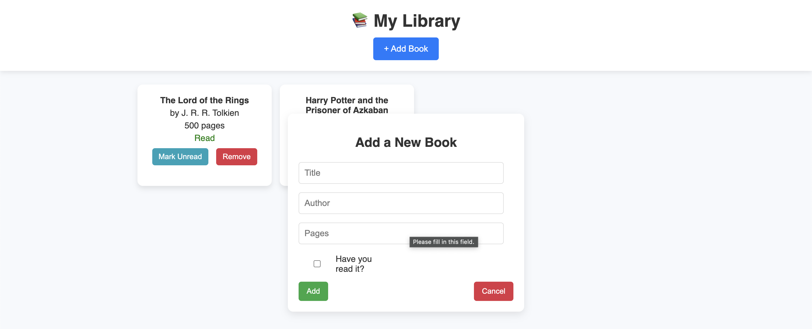

📚 Book Library App

A simple book management app that allows users to add, remove, and update book reading status.
Built with HTML, CSS, and JavaScript to practice DOM manipulation and UI design.

🔧 Technologies Used

Frontend
	•	HTML5 → Structure of the web page
	•	CSS3 → Styling and modern UI design
	•	JavaScript (Vanilla JS) → Dynamic functionality

Concepts Practiced
	•	DOM Manipulation (Creating and updating elements dynamically)
	•	Event Handling (Button clicks, form submissions)
	•	JavaScript Constructors & Prototypes
	•	CSS Flexbox for responsive design
	•	Basic UI/UX Design Principles
	•	Preventing Default Form Submission with event.preventDefault()

🎯 What I Learned

✅ JavaScript Constructors & Prototypes → I used a Book constructor function to create objects and added a toggleRead() method using prototypes.
✅ DOM Manipulation → I dynamically created and updated book elements using JavaScript (document.createElement, innerHTML).
✅ Event Handling → Handled form submission, button clicks, and dynamically generated buttons.
✅ CSS Layout & Flexbox → Designed a responsive book card layout that adjusts when resized.
✅ Popup Form Handling → Used JavaScript to show/hide the form smoothly.
✅ Preventing Default Form Behavior → Used event.preventDefault() to stop form submission from reloading the page.

